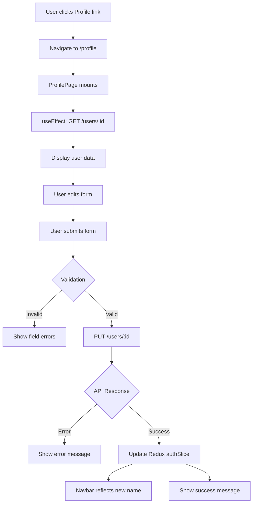

# Design Document: User Profile Feature

## Overview

The User Profile feature provides authenticated users with a self-service interface to view and edit their personal information. This feature consists of:

1. **ProfilePage Component**: A new page component at `/profile` that displays all user fields and provides an editable form for firstName, lastName, company, and phone
2. **Profile Navigation**: A new sidebar navigation link positioned above Dashboard, accessible to all authenticated users
3. **Redux Integration**: Automatic synchronization of profile updates with the auth store to ensure the Navbar reflects changes immediately
4. **Form Validation**: Client-side validation using React Hook Form and Zod for required fields and phone number format

This is a **frontend-only feature** that leverages the existing backend `GET /users/{id}` and `PUT /users/{id}` endpoints. No backend changes are required.

### Design Principles

- **Self-Service**: Users can manage their own profile without administrator intervention
- **Immediate Feedback**: Updates to firstName/lastName are reflected instantly in the Navbar without page reload
- **Consistency**: Follow existing patterns for page layout, form handling, API integration, and navigation
- **Progressive Disclosure**: Display all user information but only allow editing of specific fields
- **Defensive Programming**: Handle loading states, errors, and edge cases gracefully

---

## Architecture

### Component Hierarchy

```
App.tsx (routing)
  └─ ProtectedRoute
      └─ AppShell
          ├─ Navbar (displays user.firstName, user.lastName)
          ├─ Sidebar (includes new Profile link)
          └─ Outlet
              └─ ProfilePage (new)
                  ├─ ProfileHeader (section)
                  ├─ ProfileDetailsView (read-only fields)
                  └─ ProfileEditForm (editable fields)
```

### Data Flow



### State Management

- **Local State** (ProfilePage component):
  - `loading`: Boolean indicating data fetch in progress
  - `error`: Error message string for fetch failures
  - `submitting`: Boolean indicating form submission in progress
  - Form state managed by React Hook Form
  
- **Global State** (Redux authSlice):
  - `user`: User object containing all profile fields
  - Updated via new `updateUser` action after successful PUT request

### Integration Points

1. **Routing** (App.tsx): Register `/profile` route within protected block
2. **Navigation** (Sidebar.tsx): Add Profile navigation item at top of list
3. **API Client** (userApi.ts): Use existing `getById` and `update` methods
4. **Redux Store** (authSlice.ts): Add new `updateUser` reducer action
5. **Authentication** (ProtectedRoute): Reuse existing auth guard (no role restriction)

---

## Components and Interfaces

### 1. ProfilePage Component

**Location**: `frontend/src/pages/profile/ProfilePage.tsx`

**Responsibility**: Top-level page component that orchestrates data fetching, display, and form submission.

**Key Behaviors**:
- On mount, fetch current user data via `userApi.getById(user.id)`
- Display loading spinner during initial data fetch
- Display error message with retry button if fetch fails
- Render ProfileDetailsView (read-only section) and ProfileEditForm (editable section)
- Handle form submission, call `userApi.update`, update Redux store, show success message

**State**:
```typescript
interface ProfilePageState {
  loading: boolean
  error: string | null
  submitting: boolean
}
```

**Props**: None (retrieves user ID from Redux auth state)

### 2. ProfileEditForm Component

**Location**: `frontend/src/pages/profile/ProfileEditForm.tsx` (or inline in ProfilePage)

**Responsibility**: Editable form for firstName, lastName, company, and phone with validation.

**Form Schema** (Zod):
```typescript
const profileFormSchema = z.object({
  firstName: z.string()
    .min(1, 'First name is required')
    .max(100, 'First name must be at most 100 characters'),
  lastName: z.string()
    .min(1, 'Last name is required')
    .max(100, 'Last name must be at most 100 characters'),
  company: z.string()
    .max(150, 'Company must be at most 150 characters')
    .optional(),
  phone: z.string()
    .regex(/^[\d\s\-\(\)\+]*$/, 'Phone must contain only digits, spaces, hyphens, parentheses, or leading +')
    .max(20, 'Phone must be at most 20 characters')
    .optional()
})
```

**Props**:
```typescript
interface ProfileEditFormProps {
  initialValues: {
    firstName: string
    lastName: string
    company: string
    phone: string
  }
  onSubmit: (data: ProfileFormData) => Promise<void>
  submitting: boolean
}
```

### 3. ProfileDetailsView Component

**Location**: Inline in ProfilePage or separate component

**Responsibility**: Display read-only user fields (email, accountType, roles, mfaEnabled, lastLoginAt, createdAt).

**Props**:
```typescript
interface ProfileDetailsViewProps {
  user: User
}
```

### 4. Sidebar Navigation Update

**Location**: `frontend/src/components/layout/Sidebar.tsx`

**Change**: Add Profile navigation item to `navItems` array at index 0 (first position).

```typescript
const navItems = [
  { to: '/profile',        label: 'Profile',          icon: UserCircle,      roles: null },
  { to: '/dashboard',      label: 'Dashboard',        icon: LayoutDashboard, roles: null },
  // ... existing items
]
```

**Icon**: Import `UserCircle` from `lucide-react`

### 5. Redux authSlice Update

**Location**: `frontend/src/store/authSlice.ts`

**Change**: Add new `updateUser` reducer action to update the user object in state and localStorage.

```typescript
reducers: {
  // ... existing reducers
  updateUser(state, action: PayloadAction<User>) {
    state.user = action.payload
    localStorage.setItem('user', JSON.stringify(action.payload))
  }
}
```

**Export**: `export const { logout, clearError, setUser, updateUser } = authSlice.actions`

### 6. Routing Update

**Location**: `frontend/src/App.tsx`

**Change**: Add `/profile` route at the top of the protected routes block (no role restriction).

```typescript
const ProfilePage = lazy(() => import('@/pages/profile/ProfilePage'))

// Inside Routes, within ProtectedRoute > AppShell block:
<Route path="/profile" element={<ProfilePage />} />
<Route path="/dashboard" element={<DashboardPage />} />
// ... existing routes
```

---

## Data Models

### User Type (existing)

**Location**: `frontend/src/types/auth.types.ts`

```typescript
export interface User {
  id:          number
  firstName:   string
  lastName:    string
  email:       string
  company:     string
  phone:       string
  accountType: AccountType
  status:      UserStatus
  mfaEnabled:  boolean
  roles:       RoleName[]
  lastLoginAt: string | null
  createdAt:   string
}
```

### ProfileFormData Type (new)

**Location**: `frontend/src/pages/profile/ProfilePage.tsx` or `frontend/src/types/profile.types.ts`

```typescript
export interface ProfileFormData {
  firstName: string
  lastName:  string
  company:   string
  phone:     string
}
```

### API Request/Response

**Request** (PUT /users/:id):
```typescript
{
  firstName: string
  lastName:  string
  company:   string
  phone:     string
}
```

**Response** (200 OK):
```typescript
{
  success: true,
  data: User,  // Full User object with all fields
  message: "User updated successfully"
}
```

**Error Response** (400/401/404/500):
```typescript
{
  success: false,
  message: string,
  timestamp: string
}
```

---

## Error Handling

### Client-Side Validation Errors

**Trigger**: Form submission with invalid data  
**Handling**: React Hook Form displays inline field-level errors; form submission is blocked  
**User Experience**: Error messages appear below each invalid field in red text

**Example**:
- Empty firstName: "First name is required"
- Phone with letters: "Phone must contain only digits, spaces, hyphens, parentheses, or leading +"
- Company > 150 chars: "Company must be at most 150 characters"

### API Fetch Errors (GET /users/:id)

**Trigger**: Network failure, 401 Unauthorized, 404 Not Found, 500 Internal Server Error  
**Handling**: ProfilePage sets `error` state, displays error message with retry button  
**User Experience**: Error banner with message and "Retry" button; form is hidden until retry succeeds

**Example**:
```
⚠️ Failed to load profile information. Please try again.
[Retry]
```

### API Update Errors (PUT /users/:id)

**Trigger**: Network failure, validation error from backend, 401/403/500  
**Handling**: ProfilePage displays error message above form; form values are retained  
**User Experience**: Error banner with message; user can correct and resubmit

**Example**:
```
❌ Failed to update profile: Email already in use by another account.
```

### Unauthenticated Access

**Trigger**: User not logged in attempts to access `/profile`  
**Handling**: ProtectedRoute redirects to `/login` with return URL  
**User Experience**: User sees login page; after successful login, redirected back to `/profile`

---

## Testing Strategy

This feature is **frontend UI work** involving form handling, API integration, and state management. Property-based testing is **not appropriate** for this type of feature. Instead, we will use:

### 1. Unit Tests (React Testing Library + Vitest)

**Purpose**: Test individual component behaviors, form validation, and Redux actions

**Test Cases**:

#### ProfileEditForm Component
- Renders form fields with initial values
- Shows validation error when firstName is empty
- Shows validation error when lastName is empty
- Shows validation error when phone contains invalid characters (e.g., letters)
- Does not show error when company is empty (optional field)
- Does not show error when phone is empty (optional field)
- Calls onSubmit with correct data when form is valid
- Does not call onSubmit when form is invalid
- Disables submit button when submitting prop is true

#### ProfilePage Component
- Fetches user data on mount
- Shows loading spinner during data fetch
- Displays user data after successful fetch
- Shows error message when fetch fails
- Shows retry button when fetch fails
- Calls userApi.update with correct data on form submit
- Updates Redux store with new user data after successful update
- Shows success message after successful update
- Shows error message when update fails
- Retains form values when update fails

#### Redux authSlice
- `updateUser` action updates user in state
- `updateUser` action persists user to localStorage
- Updated user data includes new firstName and lastName

### 2. Integration Tests

**Purpose**: Test full user flows with mocked API responses

**Test Flows**:

#### Happy Path: View and Edit Profile
1. User navigates to `/profile`
2. Mock successful `GET /users/:id` response
3. Verify all user fields are displayed
4. User edits firstName, lastName, company, phone
5. User submits form
6. Mock successful `PUT /users/:id` response
7. Verify Redux store is updated
8. Verify success message is displayed
9. Verify form reflects new values

#### Error Path: Fetch Failure
1. User navigates to `/profile`
2. Mock failed `GET /users/:id` response (500 error)
3. Verify error message is displayed
4. Verify retry button is displayed
5. User clicks retry
6. Mock successful response on retry
7. Verify profile data is now displayed

#### Error Path: Update Failure
1. User navigates to `/profile`
2. Mock successful fetch
3. User edits firstName
4. User submits form
5. Mock failed `PUT /users/:id` response (400 error)
6. Verify error message is displayed
7. Verify form retains edited values
8. User corrects and resubmits
9. Mock successful response
10. Verify success message

#### Validation Path: Client-Side Errors
1. User navigates to `/profile`
2. Mock successful fetch
3. User clears firstName field
4. User submits form
5. Verify "First name is required" error is shown
6. Verify API call is NOT made
7. User enters invalid phone (e.g., "123-abc")
8. User submits form
9. Verify phone validation error is shown
10. Verify API call is NOT made

### 3. Manual Testing

**Purpose**: Verify visual design, responsive behavior, and end-to-end integration

**Test Checklist**:
- [ ] Profile link appears in sidebar above Dashboard
- [ ] Profile link is highlighted when on `/profile` route
- [ ] All user fields are displayed correctly
- [ ] Email and accountType fields are read-only (visually distinct)
- [ ] Form fields are pre-populated with current values
- [ ] Validation errors display correctly inline
- [ ] Success message displays after update
- [ ] Navbar updates immediately after firstName/lastName change
- [ ] Unauthenticated users are redirected to login
- [ ] Page is responsive on mobile, tablet, desktop
- [ ] Loading spinner displays during fetch and submit

### 4. Accessibility Testing

**Purpose**: Ensure the feature is usable for users with assistive technologies

**Test Checklist**:
- [ ] All form inputs have associated labels
- [ ] Error messages are announced to screen readers
- [ ] Submit button is keyboard-accessible
- [ ] Focus management is logical (tab order)
- [ ] Color contrast meets WCAG AA standards
- [ ] Form can be submitted with Enter key

---

## Implementation Notes

### Styling Consistency

Follow existing Tailwind CSS patterns:
- **Card Layout**: Use `bg-white rounded-xl shadow-sm border border-gray-100 p-6`
- **Form Inputs**: Use existing input styles from LoginPage/RegisterPage
- **Buttons**: Primary button style matches existing submit buttons
- **Error Messages**: Red text (`text-red-600`) below fields
- **Success Messages**: Green background banner (`bg-green-50 text-green-800 border border-green-200`)

### Loading States

- **Initial Load**: Full-page spinner using `PageLoader` component
- **Form Submit**: Disable submit button, show loading text ("Updating..." instead of "Update Profile")

### Date Formatting

Use `date-fns` for lastLoginAt and createdAt:
```typescript
import { format } from 'date-fns'
format(new Date(user.lastLoginAt), 'dd MMM yyyy, HH:mm')
```

### Phone Validation Details

The phone regex `/^[\d\s\-\(\)\+]*$/` allows:
- Digits: `0-9`
- Spaces: ` `
- Hyphens: `-`
- Parentheses: `(` `)`
- Leading plus: `+` (for international format)

Valid examples: `+1 (555) 123-4567`, `555-1234`, `5551234567`  
Invalid examples: `555-CALL`, `abc123`, `555.1234`

### Redux Store Synchronization

When the PUT request succeeds, dispatch the `updateUser` action with the full User object returned from the API (not just the form fields). This ensures all fields remain in sync, including server-computed fields like `updatedAt` if added in the future.

```typescript
dispatch(updateUser(response.data.data)) // Full User object from API
```

### Security Considerations

- The ProfilePage component retrieves the user ID from the Redux auth state (`user.id`)
- Users can only view/edit their own profile (enforced by using their own ID)
- The backend endpoint `PUT /users/:id` should verify that the authenticated JWT user matches the target user ID
- No client-side role restrictions on the `/profile` route (all authenticated users can access)

### Internationalization (Future)

This design uses hardcoded English strings. If i18n is added in the future:
- Extract all user-facing strings to translation files
- Update validation error messages to use translated keys
- Format dates according to user locale

---

## Open Questions / Decisions

### 1. Should users be able to change their email address?

**Decision**: No. Email is used as the login identifier and changing it has authentication implications (email verification, session management). This feature only allows editing firstName, lastName, company, and phone per requirements.

### 2. Should we show a "Cancel" button on the edit form?

**Recommendation**: Yes. Add a "Cancel" button that resets the form to initial values. This provides a clear escape path if the user makes unwanted changes.

### 3. Should we add password change functionality?

**Decision**: Out of scope for this feature. Password change should be a separate feature with current password verification and email confirmation.

### 4. Should we allow users to upload a profile picture?

**Decision**: Out of scope. The Navbar currently displays initials in a circular avatar. Profile pictures would require file upload, storage (S3), and backend changes.

### 5. Should the Profile link have a badge showing pending actions (like MFA setup)?

**Recommendation**: Out of scope for this iteration. Could be added in a future enhancement if we want to nudge users to complete their profile or enable MFA.

---

## Deployment Considerations

### Frontend Deployment

1. **Build**: Run `npm run build` in `frontend/` directory
2. **Static Assets**: Generated in `frontend/dist/`
3. **Environment Variables**: No new environment variables required
4. **Routing**: Ensure SPA routing is configured on the web server (redirect all non-asset requests to `index.html`)

### No Backend Changes

This feature uses existing backend endpoints:
- `GET /users/:id` — Fetch user by ID
- `PUT /users/:id` — Update user fields

No database migrations, API changes, or backend deployments are required.

### Testing in Production

Before marking as complete:
1. Verify `/profile` route is accessible to all authenticated users
2. Test profile editing with various roles (CUSTOMER_ADMIN, SALES_AGENT, etc.)
3. Verify Navbar updates immediately after firstName/lastName change
4. Test validation edge cases (empty fields, special characters in phone)
5. Monitor API error logs for unexpected 400/500 responses

---

## Future Enhancements

1. **Profile Picture Upload**: Allow users to upload and display a profile image
2. **Password Change**: Add a "Change Password" section with current password verification
3. **Email Change**: Allow email updates with verification flow (send confirmation email to new address)
4. **Notification Preferences**: Allow users to opt in/out of email notifications
5. **Activity Log**: Display recent account activity (login history, profile changes)
6. **Two-Factor Authentication Setup**: Integrate MFA setup flow into profile page
7. **Account Deletion**: Allow users to request account deletion (with approval workflow)
8. **Export Data**: Provide a "Download My Data" button (GDPR compliance)

---

## Summary

The User Profile feature provides a self-service interface for authenticated users to view and edit their personal information. The implementation is straightforward:

- **Single new page component** (ProfilePage) with form handling and API integration
- **Minimal changes to existing code** (add route, add sidebar link, add Redux action)
- **No backend work required** (uses existing API endpoints)
- **Follows established patterns** (React Hook Form + Zod, Redux Toolkit, Tailwind CSS)

The design prioritizes simplicity, consistency with existing UI patterns, and a smooth user experience with immediate feedback for profile updates.
