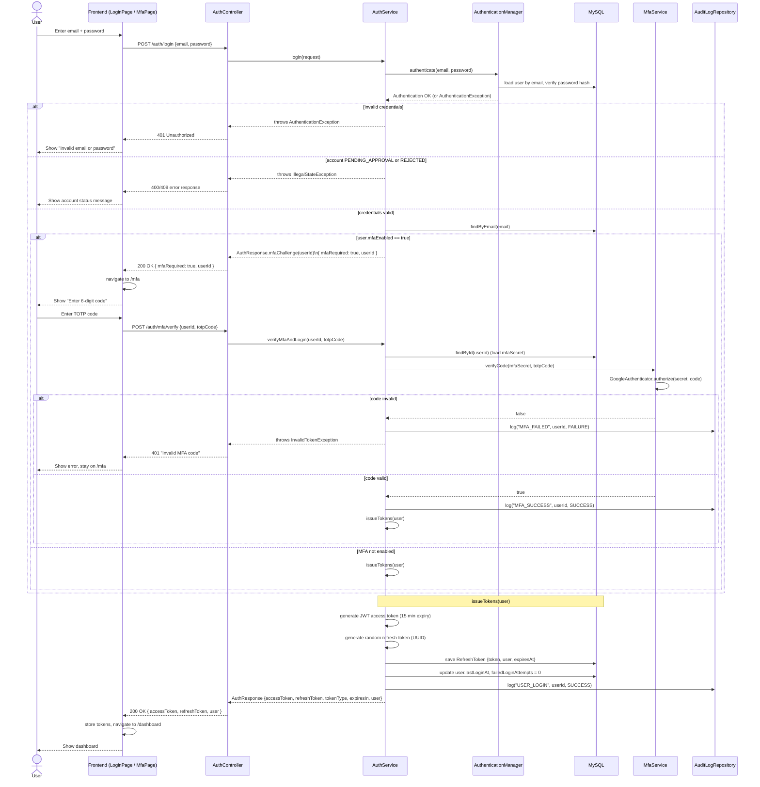

# Sequence Diagrams

## Login + MFA Authentication Flow

Covers `POST /auth/login` and `POST /auth/mfa/verify`, as implemented in
`AuthController`, `AuthService`, and `MfaService`.

### Notes
- The login endpoint returns `mfaRequired: true` with only a `userId` (no
  tokens) when the user has MFA enabled; tokens are issued only after
  `/auth/mfa/verify` succeeds.
- `issueTokens` is shared by the non-MFA login path, the MFA-verified path,
  and `POST /auth/refresh`.
- Every login attempt outcome (success, MFA failure/success, logout) is
  written to `AuditLog` via `AuditLogRepository`.
