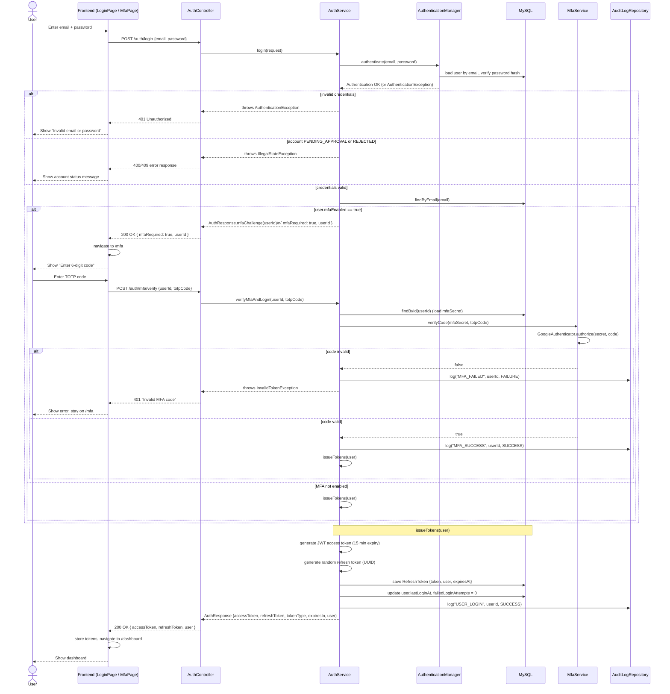
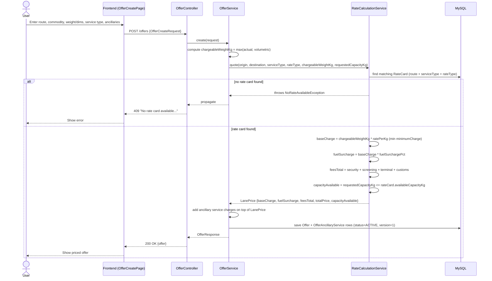
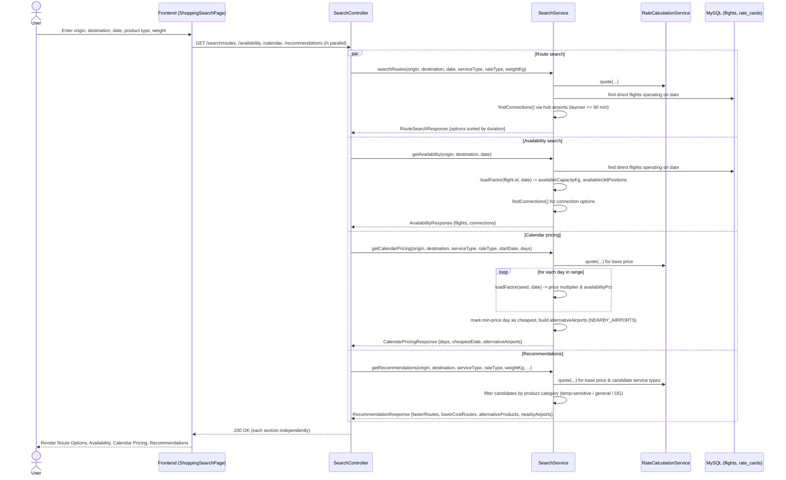

# Sequence Diagrams

## Login + MFA Authentication Flow

Covers `POST /auth/login` and `POST /auth/mfa/verify`, as implemented in
`AuthController`, `AuthService`, and `MfaService`.

### Notes
- The login endpoint returns `mfaRequired: true` with only a `userId` (no
  tokens) when the user has MFA enabled; tokens are issued only after
  `/auth/mfa/verify` succeeds.
- `issueTokens` is shared by the non-MFA login path, the MFA-verified path,
  and `POST /auth/refresh`.
- Every login attempt outcome (success, MFA failure/success, logout) is
  written to `AuditLog` via `AuditLogRepository`.

---

## Offer Creation & Pricing Flow

Covers `POST /offers`, as implemented in `OfferController`, `OfferService`,
and `RateCalculationService`.

### Notes
- `chargeableWeightKg` is the greater of the actual `weightKg` and the
  volumetric weight derived from `lengthCm * widthCm * heightCm`.
- `RateCalculationService.quote()` returns the lane-level price breakdown
  (`LanePrice`); `calculate()` (used by `OfferService`) wraps `quote()` and
  adds ancillary service charges to produce the full `PricingResult`.
- `POST /offers/{id}/revise` repeats this flow with a new request body, then
  marks the original offer `SUPERSEDED` and links the new offer via
  `parentOfferId` with `version + 1`.

---

## Shopping & Search Flow

Covers `GET /search/routes`, `/availability`, `/calendar`, and
`/recommendations`, as implemented in `SearchController` and `SearchService`.

### Notes
- All four endpoints are read-only — no capacity is reserved by a search.
- `loadFactor(seed, date)` is a deterministic MurmurHash3-based function in
  `[0.35, 0.90]` that drives date-varying availability and pricing without a
  booking ledger.
- The frontend issues all four requests via `Promise.allSettled`, so a 409
  (no rate card) on `/recommendations` does not block the other sections from
  rendering.
- `NEARBY_AIRPORTS` maps alternate airports for the same metro area
  (`JFK ↔ EWR`, `LHR ↔ LGW`), used by both calendar pricing and
  recommendations to surface cheaper nearby-airport options.
